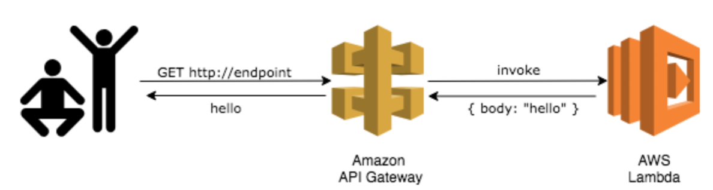

# AWS CDK Workshop

This project contains a Java implementation of an AWS Cloud Development Kit (CDK) app that was developed as 
part of  completing the AWS CDK online tutorial ["CDK workshop"](https://cdkworkshop.com/).

The app maintains a persistent record of the number of requests ('hits') made to an API endpoint. It is implemented 
as an AWS serverless app using AWS API Gateway, a couple of Lambda functions, and DynamoDB. The supported AWS 
resources, and the app code, are deployed using the AWS CDK. 



The app includes a custom CDK construct that provides an example of how to bundle a bunch of AWS resources / 
infrastructure into a higher-level reusable components that anyone can compose into their apps. In this example the 
CDK construct is used to provision the application's backend (Lambda function and Dynamo DB table). 

The app also contains an example of how to consume a CDK construct published by a third party. In this example, the 
construct is consumed from a public Maven repo and provides a web page for viewing a DynamoDB table.

## Overview of Project
This is a Maven project, the starting point for which was originally generated from a Java / Maven CDK app template 
provided by the CDK, using the following command -
```
cdk init sample-app --language java
```

The table below contains a list of the major files in the project and their purpose - 

|Name|Description|
|----|-----------|
|AmazonCdkWorkshopApp.java|Java class that provides the entrypoint for the CDK app. It loads the CDK stack defined in AmazonCdkWorkshopStack.java.|
|AmazonCdkWorkshopStack.java|Java class in which the CDK application’s main stack is defined.|
|AmazonCdkWorkshopStackTest.java| An automated JUnit test that verifies that the CDK app’s synthesising method produces a CloudFormation (JSON) stack template containing the expected AWS resources.|
|HitCounter.java|A custom CDK Construct that can be attached to a Lambda function that’s used as a backend for an API Gateway, which counts the number of requests received for each URL path, and stores it in a DynamoDB table.|
|pom.xml|Maven build script. Contains information on build properties, dependencies, and app information.|
|cdk.json|Tells the CDK toolkit (CLI) how to run the app. In the case of a Java CDK app that uses Maven it uses the Maven command "mvn -q exec:java".|


## Useful commands
* `mvn package` - Compile and run the tests.
* `cdk ls` - List all stacks in the app.
* `cdk synth` - Emit the synthesized CloudFormation template.
* `cdk deploy` - Deploy this stack to your default AWS account/region.
* `cdk diff` - Compare the deployed stack with current state.
* `cdk docs` - Open CDK documentation in your browser.

End.